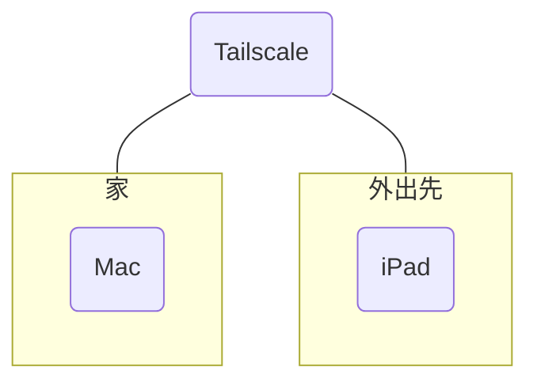

# MacをiPadから使う
自宅にMacを置いたままiPadのみを持って外出している場合でも、iPadからMacに遠隔接続し、操作することを可能にします。

## 前提
1. MacにHomebrewをインストールしていること
2. Macは常時起動していること
3. MacとiPadはインターネットに接続していること

## 1 Tailscaleをインストールする
TailscaleとはVPNを提供するアプリです。MacとiPadが同一VPNに接続することにより仮想LANを構築し、ポートを外部に公開することなく安全に遠隔接続できるようにします。

まずはMacにTailscaleをインストールします。
```zsh
brew install --cask tailscale
brew install tailscale
```
GUI版とCUI版の両方をインストールしています。
インストールしたGUI版を開き、アカウントの新規作成/ログインをして下さい。

次にiPadにもApp Store経由でTailscaleをインストールします。Mac版と同じアカウントでログインして下さい。

TailscaleでMacとiPadの両方がリストされていれば仮想LANは構築できています。

## 2 hbbs/hbbrサーバーを構築する
いずれも遠隔接続に必要なサーバーです。
Dockerコンテナとして提供されているので、まずはDockerをインストールします。
```zsh
brew install --cask docker
```
Docker Desktopを起動して下さい。dockerdというデーモンが起動し、コンテナを動かせるようになります。以降、Docker Desktopは閉じてしまっても構いませんが、終了はしないでください（メニューバーにDockerアイコンが出る状態にする）。

次にサーバー情報を保存するためのディレクトリを作成します。
```zsh
mkdir ~/Documents/rustdesk-server
```

hbbsサーバーを構築します。
```zsh
docker run -d --name hbbs --restart unless-stopped \
-v "$HOME/Documents/rustdesk-server:/root" \
-p 21115:21115 \
-p 21116:21116 \
-p 21116:21116/udp \
rustdesk/rustdesk-server hbbs
```

hbbrサーバーを構築します。
```zsh
docker run -d --name hbbr --restart unless-stopped \
  -v "$HOME/Documents/rustdesk-server:/root" \
  -p 21117:21117 \
  -p 21118:21118 \
  -p 21119:21119 \
  rustdesk/rustdesk-server hbbr
```

docker runコマンドにより、rustdeskサーバーのhbbsとhbbrを起動しています。-dオプションは、サーバーをバックグラウンドで動かすためのものです。--restart unless-stoppedを付けたので、明示的に停止させない限りは自動的にサーバーが再起動します。

## 3 接続に必要な情報を得る
1. 仮想LANにおけるMacのIPアドレス（＝hbbs/hbbrサーバーのIPアドレス）
2. hbbsサーバーが発行する公開鍵

の2つの情報が必要です。

### 3.1 IPアドレス
MacのIPアドレスはTailscaleから知ることができます。GUIでMacの情報を見ても良いですし、
```zsh
tailscale ip -4
```
の値を見ても良いです。

### 3.2 公開鍵
公開鍵は2章で作成したディレクトリに出力されています。`id_ed25519.pub`というファイルをテキストエディタで開いてください。

## 4 Rustdeskをインストールする
Rustdeskとは遠隔操作を可能にするアプリです。Mac側の発行するリモートIDと設定したパスワードをiPad側で入力すると、iPadでMacの画面を見たり、Macのリソースを利用して様々な作業をしたりできるようになります。

まずはMacにRustdeskをインストールします。
```zsh
brew install --cask rustdesk
```
インストールしたRustdeskを起動し、`Settings>Network`へ進みます。認証/中継サーバー情報としてIPアドレスを入力し、Keyとして公開鍵を入力してください。

続けて`Settings>Security`へ進みます。認証方式として`Permanent Password`を選択してください。`Permanent Password`には長く堅牢なパスワードを設定しておき、パスワードアプリに記憶させておきましょう。デフォルトではワンタイムパスワードを使うようになっていますが、この設定ではワンタイムパスワードを知るためにはMacの前に誰かがいなくてはなりません。それでは遠隔接続が出来ないので、固定のパスワードを使用します。

iPadにもApp Store経由でRustdeskをインストールします。Mac版と同様に、認証/中継サーバー情報としてIPアドレスを入力し、Keyとして公開鍵を入力してください。

## 5 ログイン項目・権限を設定する
遠隔接続には、
1. Tailscale
2. Docker(hbbs/hbbr)
3. Rustdesk

の起動が必須です。そのため、この3つをログイン項目として設定しておくと良いでしょう。Macにログインした時に自動的にこれらアプリが起動するので、不意の接続不良をふせぐことができます。

また、遠隔操作を許す以上、Rustdeskにはいくつかの権限を与える必要があります。Macの設定から、以下の権限を与えておきましょう。
1. アクセシビリティ
2. ローカルネットワーク
3. 画面収録とシステムオーディオ録音

## 6 接続する
Mac側Rustdeskを見ると、リモートIDが発行されています。このIDをiPad版Rustdeskに入力すると、`Permanent Password`の入力後に、Macの画面がiPadに投影されます。
