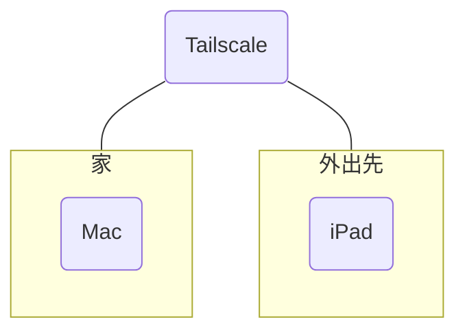

# use-Mac-from-iPad
自宅にMacがあり、iPadのみを持って外出している場合でも、iPadからMacに遠隔接続し、操作することを可能にします。

## 前提
1. MacにHomebrewをインストールしていること
2. Macは常時起動していること
3. MacとiPadはインターネットに接続していること

## 1 Tailscaleをインストールする
TailscaleとはVPNを提供するアプリです。MacとiPadが同一VPNに接続することにより仮想LANを構築し、安全性を確保します。

まずはMacにTailscaleをインストールします。
```zsh
brew install --cask tailscale
brew install tailscale
```
GUI版とCUI版の両方をインストールしています。
インストールしたGUI版を開き、アカウントの新規作成/ログインをして下さい。

次にiPadにもApp Store経由でTailscaleをインストールします。Mac版と同じアカウントでログインして下さい。

TailscaleでMacとiPadの両方がリストされていれば仮想LANは構築できています。

## 2 Rustdeskをインストールする

## 3 hbbs/hbbrサーバーを構築する

## 4 接続に必要な情報を得る

## 5 Rustdeskを設定する

## 6 接続する
